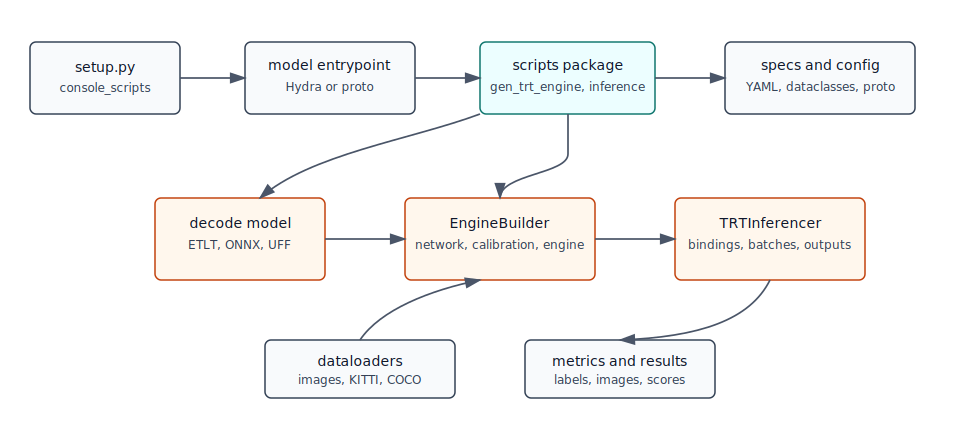

# Architecture



TAO Deploy is organized around installed task commands. Each command dispatches
to model-specific scripts that build TensorRT engines, run inference, evaluate
outputs, or generate default specs.

## Command Flow

1. `setup.py` declares console scripts such as `dino`, `classification_tf1`,
   `model_agnostic`, and `clip`.
2. Each console script imports a model entrypoint under
   `nvidia_tao_deploy/cv/MODEL_NAME/entrypoint/` or
   `nvidia_tao_deploy/multimodal/MODEL_NAME/entrypoint/`.
3. Newer commands use `nvidia_tao_deploy.cv.common.entrypoint.entrypoint_hydra`.
   The entrypoint discovers Python files in the model `scripts/` package,
   accepts a subtask name, accepts `-e/--experiment_spec_file` for normal
   subtasks, and dispatches to the selected script.
4. Older commands use `entrypoint_proto.launch_job`. Those scripts define their
   own `build_command_line_parser()` functions and generally consume proto-style
   experiment specs.
5. Script modules call common helpers such as `decode_model()`,
   `initialize_gen_trt_engine_experiment()`, model-specific `EngineBuilder`
   classes, and `TRTInferencer` subclasses.
6. Status logging and telemetry are handled by decorators and shared entrypoint
   code, while results are written under the configured results directory.

`model_agnostic` is a special command. It reads `model_name` from the experiment
spec, imports that model's scripts package, and then delegates to the same
Hydra-style launch path.

## Configuration Flow

Hydra-style deploy backends use two source areas:

| Source | Role |
| :--- | :--- |
| `nvidia_tao_deploy/config/MODEL_NAME/default_config.py` | Structured dataclass schema for the model. |
| `nvidia_tao_deploy/cv/MODEL_NAME/specs/*.yaml` | Runtime spec templates named by each script's `hydra_runner(config_name=...)`. |

The subtask name and the YAML filename are not always identical. For example,
DINO exposes an `inference` subtask while `nvidia_tao_deploy/cv/dino/scripts/inference.py`
uses `config_name="infer"`, so the default template is `infer.yaml`.

Legacy TF1-style and some older CV commands keep proto files under the model
package and build argparse parsers in each script. Those commands should be
extended in their existing style unless a broader migration is planned.

## TensorRT Runtime

The shared runtime is concentrated in:

| Path | Responsibility |
| :--- | :--- |
| `nvidia_tao_deploy/engine/builder.py` | Base `EngineBuilder` behavior for parsing ONNX/UFF/ETLT and creating engines. |
| `nvidia_tao_deploy/engine/calibrator.py` and `tensorfile_calibrator.py` | INT8 calibration support. |
| `nvidia_tao_deploy/inferencer/trt_inferencer.py` | Base TensorRT execution wrapper. |
| `nvidia_tao_deploy/utils/decoding.py` | Encrypted model decoding. |
| `nvidia_tao_deploy/utils/image_batcher.py` | Image batching for inference. |
| `nvidia_tao_deploy/dataloader/` | Shared dataset readers. |
| `nvidia_tao_deploy/metrics/` | KITTI, COCO, and segmentation metrics. |

Model packages add specialized builders and inferencers when the generic
runtime is not enough. DINO reuses D-DETR builder and inferencer classes, CLIP
adds multimodal engine and inferencer support, and proto-era models often keep
their builders beside the model package.

## Container Flow

Source development usually starts with:

```sh
source scripts/envsetup.sh
tao_deploy --gpus all
```

`scripts/envsetup.sh` sets `NV_TAO_DEPLOY_TOP` and defines the shell function.
`runner/tao_deploy.py` reads `docker/manifest.json`, selects the x86 or ARM
digest from the host architecture, pulls the base image if needed, mounts the
source checkout into `/workspace/tao-deploy`, and runs the requested command.

See [Container power users](container_power_users.md) for direct Docker
equivalents and troubleshooting.
