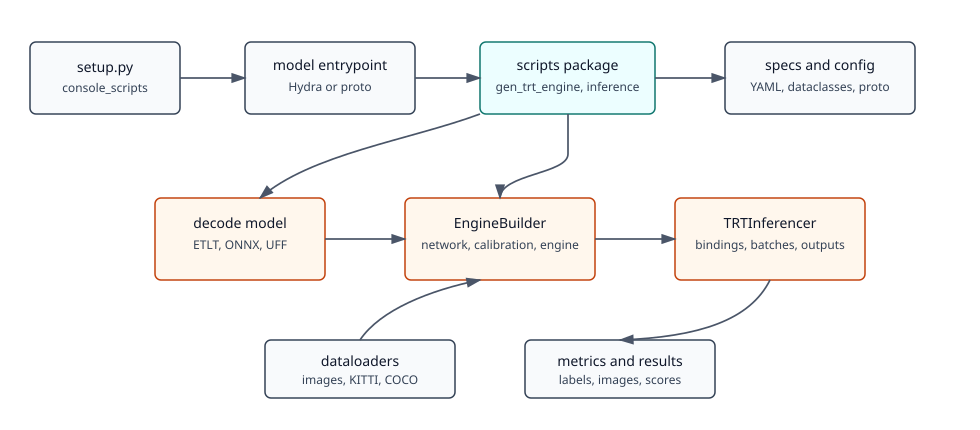
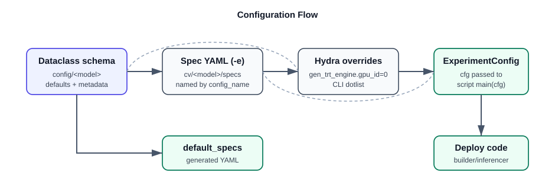

# Architecture

This guide explains the runtime and source-code flow for TAO Deploy model
families: how a console command reaches a script, how configuration is
validated, and how the shared TensorRT runtime is layered. For a directory-level
orientation, read the [Codebase tour](codebase_tour.md) first.



TAO Deploy is a deployment runtime repository, not a training repository. Every
command accepts an exported model (ONNX or encrypted ETLT), builds or loads a
TensorRT engine, runs inference or evaluation, and writes outputs under a
results directory.

## Command Runtime Flow

`setup.py` registers each installed command:

```text
dino=nvidia_tao_deploy.cv.dino.entrypoint.dino:main
```

There are three entry point styles, all in
`nvidia_tao_deploy/cv/common/entrypoint/`:

| Style | Module | Used by |
| :--- | :--- | :--- |
| Hydra (modern) | `entrypoint_hydra.py` | 21 CV families plus `clip` and `video_clip`. YAML specs validated against dataclass schemas. |
| Proto (legacy) | `entrypoint_proto.py` | 12 TF1-era families. Protobuf text specs; each script defines `build_command_line_parser()`. |
| Agnostic | `entrypoint_agnostic.py` | The `model_agnostic` command. Reads `model_name` from the spec, imports that family's scripts, then delegates to the Hydra path. |

The Hydra entrypoint (`entrypoint_hydra.py`) does the following:

1. `get_subtasks(<model>.scripts)` walks the scripts package with `pkgutil`
   and records each module as a subtask, then injects the synthetic
   `default_specs` subtask (implemented in
   `cv/common/spec_utils/default_specs.py`).
2. `command_line_parser()` validates the positional subtask and
   `-e/--experiment_spec_file`.
3. `launch()` converts the spec path into `--config-path <dir>` and
   `--config-name <file>`, forwards unknown CLI tokens verbatim as Hydra
   overrides, resolves the GPU ID into `CUDA_VISIBLE_DEVICES`, and spawns the
   selected script as a **fresh Python subprocess**, teeing stdout (and to
   `$TAO_MICROSERVICES_TTY_LOG/$JOB_ID/microservices_log.txt` when `JOB_ID` is
   set). It then reports telemetry and exits with the child's status.

`launch()` intentionally clamps execution to one GPU; it parses `num_gpus` and
`gpu_ids` and then reduces them to a single device.

Inside the child process, every Hydra-style script has the same shape:

```python
@hydra_runner(config_path=os.path.join(spec_root, "specs"),
              config_name="gen_trt_engine", schema=ExperimentConfig)
@monitor_status(name="dino", mode="gen_trt_engine")
def main(cfg: ExperimentConfig) -> None:
    ...
```

`hydra_runner` (`cv/common/hydra/hydra_runner.py`) registers the schema in
Hydra's `ConfigStore` and suppresses Hydra's output directories.
`monitor_status` (`cv/common/decorators.py`) creates the results directory,
dumps the resolved configuration to `<results_dir>/experiment.yaml`, writes structured
progress to `<results_dir>/status.json`, and maps exception classes to
user-facing status messages that the entrypoint matches for telemetry.

## Configuration Flow



Hydra-style families use two source areas:

| Source | Role |
| :--- | :--- |
| `nvidia_tao_deploy/config/<model>/default_config.py` | Structured dataclass schema. Always defines `ExperimentConfig`, usually extending `CommonExperimentConfig` from `config/common/common_config.py`. |
| `nvidia_tao_deploy/cv/<model>/specs/*.yaml` | Default spec templates, named by each script's `hydra_runner(config_name=...)`. |

The configuration precedence at runtime is:

```text
dataclass defaults -> spec YAML (-e) -> command-line Hydra overrides
```

Schemas declare their fields through typed factories from
`config/utils/types.py` (`STR_FIELD`, `INT_FIELD`, `FLOAT_FIELD`, `BOOL_FIELD`,
`LIST_FIELD`, `DICT_FIELD`, `DATACLASS_FIELD`, ...). Each factory attaches
metadata (`description`, `display_name`, `valid_options`, `valid_min`,
`valid_max`, and `default_value`) that powers specification generation and the
FTMS/API specification UI. The metadata `default_value` and the dataclass
default `value` are separate and can differ.

Shared configuration bases in `config/common/common_config.py` include
`CommonExperimentConfig`, `GenTrtEngineConfig`, `TrtConfig`, and
`CalibrationConfig`; deploy schemas mirror the training-side schemas in
tao-pytorch, and `tests/core/test_backbone_schema_drift.py` guards selected
mirrors against drifting.

**The subtask name and the specification template name are not always identical.** The
source of truth is each script's `hydra_runner(config_name=...)`:

| Pattern | Families |
| :--- | :--- |
| `inference.py` -> `config_name="infer"` | centerpose, deformable_detr, dino, grounding_dino, mask_grounding_dino, rtdetr, segformer, depth_net, mask2former, oneformer, visual_changenet |
| One shared spec for all subtasks | classification_tf2, efficientdet_tf2 (`experiment_spec`), ocrnet, optical_inspection (`experiment`) |
| `gen_trt_engine.py` -> `config_name="export"` | segformer, ml_recog |
| `evaluate.py` -> `config_name="infer"` | mask2former, oneformer, segformer |
| No matching default template (subtask requires `-e`) | ml_recog `gen_trt_engine`, all depth_net subtasks, all visual_changenet subtasks |

Legacy proto families keep `.proto` definitions and checked-in `*_pb2.py`
under `<model>/proto/` and parse text specifications in each script. Extend those
families in their existing style unless a broader migration is planned.

Generate a default specification for a Hydra family with:

```sh
<model> default_specs results_dir=/tmp/<model>_specs
```

## TensorRT Runtime

The shared runtime has three layers: build, execute, and evaluate.

```text
decode_model()                      # utils/decoding.py: .etlt/.onnx/.uff -> ONNX bytes
  -> EngineBuilder.create_network() # engine/builder.py: parse ONNX, build optimization profile
  -> EngineBuilder.create_engine()  # precision flags, INT8 calibration, serialize .engine
  -> TRTInferencer                  # inferencer/trt_inferencer.py: load engine, allocate buffers
  -> dataloader + metrics           # evaluate: batches + GT -> mAP/AP/mIoU
```

| Path | Responsibility |
| :--- | :--- |
| `engine/builder.py` | `EngineBuilder` (abstract base): ONNX parsing, dynamic-axis optimization profiles, precision selection (`fp32/fp16/bf16/int8`, strongly typed for QDQ-quantized ONNX), per-layer precision, timing cache, and engine serialization. |
| `engine/calibrator.py` | `EngineCalibrator`: INT8 post-training calibration driven by an `ImageBatcher` over a calibration image directory. |
| `engine/tensorfile_calibrator.py` | `TensorfileCalibrator`: legacy INT8 calibration from `.tensorfile` (HDF5) archives. |
| `inferencer/base_inferencer.py` | `BaseInferencer` abstract contract (`load_model`, `infer`, drawing helpers). |
| `inferencer/trt_inferencer.py` | `TRTInferencer`: engine deserialization, I/O tensor discovery (exposed as `Tensor`/`InputTensor` objects from `types/tensors.py`), and the execute loop. |
| `inferencer/utils.py` | `HostDeviceMem`, `allocate_buffers()`, `do_inference()`. |
| `utils/decoding.py` | `decode_model()` dispatches on extension; `.etlt` payloads are decrypted and identified as ONNX or UFF. |
| `utils/image_batcher.py` | `ImageBatcher`: directory to batched arrays with named preprocessing modes; used by both inference and INT8 calibration. |
| `dataloader/` | `COCOLoader` and KITTI/ADE20K/COCO-panoptic readers pairing preprocessed batches with ground truth. |
| `metrics/` | COCO mAP (pycocotools), KITTI AP, semantic-segmentation mIoU. |

Model families specialize this runtime by subclassing: the repository has roughly 22
`EngineBuilder` subclasses and 29 `TRTInferencer` subclasses. Families
frequently share a sibling's classes: `dino` reuses the `deformable_detr`
builder, inferencer, and dataloader, and `rtdetr` reuses its builder and
inferencer. Legacy UFF/plugin-era
families override `create_network()`; on TensorRT >= 9 the UFF paths raise
`NotImplementedError`, so those families are ONNX/ETLT-ONNX only on current
base images.

Calibration configuration is validated centrally in
`cv/common/initialize_experiments.py::initialize_gen_trt_engine_experiment()`,
which checks calibration batch math and image counts, parses
`layers_precision` entries, and returns the kwarg dicts that every Hydra
`gen_trt_engine.py` unpacks into its builder.

## TAO Core Boundary

`tao-core/` is a git submodule providing shared TAO infrastructure. TAO Deploy
consumes it three ways:

* **Status callbacks:** `cv/common/logging/status_logging.py` imports from
  `nvidia_tao_core.microservices` (unguarded — the submodule must be
  initialized or every command fails at import).
* **Telemetry:** both entrypoints soft-import
  `nvidia_tao_core.telemetry` and degrade gracefully without it.
* **Release container:** `release/docker/Dockerfile.release` builds and
  installs the tao-core wheel and uses tao-core's microservice app as the
  container entrypoint.

For local development the submodule is mounted with the checkout at
`/workspace/tao-deploy/tao-core`, and the launcher's `PYTHONPATH` setup makes
`nvidia_tao_core` importable from there.

## Container Flow

Source development usually starts with:

```sh
source scripts/envsetup.sh
tao_deploy --gpus all
```

`scripts/envsetup.sh` sets `NV_TAO_DEPLOY_TOP`, defines the `tao_deploy` shell
function, and installs the repository's git hooks. `runner/tao_deploy.py` reads
`docker/manifest.json`, selects the x86 or ARM digest from the host
architecture, pulls the base image if needed, mounts the source checkout at
`/workspace/tao-deploy`, and runs the requested command.

Refer to [Container power users](container_power_users.md) for direct Docker
equivalents and troubleshooting.

## Cross-Repository Contract

A model family in TAO Deploy consumes what the matching family in tao-pytorch
exports. When changing either side, verify:

* The export configuration fields in tao-pytorch align with what the deploy
  schema in `nvidia_tao_deploy/config/<model>/` expects.
* The input names, shapes, and dynamic axes assumed by the deploy engine
  builder and dataloader match the exported ONNX.
* The console command exists on both sides with consistent subtask naming.
