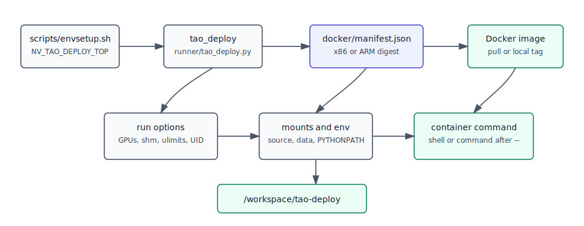

# Container Power Users



The `tao_deploy` shell function is the normal source checkout launcher. It runs
commands inside the TAO Deploy base image while mounting this repository at
`/workspace/tao-deploy`.

## Launcher Setup

```sh
source scripts/envsetup.sh
```

This sets `NV_TAO_DEPLOY_TOP` and defines:

```sh
tao_deploy --gpus all
```

Append a command after `--` to run it inside the container:

```sh
tao_deploy --gpus all -- python3 -m pytest tests/core/test_dual_logging.py
```

## Image Source

`runner/tao_deploy.py` reads `docker/manifest.json` and uses:

| Manifest field | Meaning |
| :--- | :--- |
| `registry` | Container registry, currently `nvcr.io`. |
| `repository` | Base image repository. |
| `digests.x86` | x86_64 image digest. |
| `digests.arm` | aarch64 image digest. |

The runner selects the digest from `platform.machine()`. Use `--tag` to run a
locally built tag instead of the manifest digest:

```sh
tao_deploy --tag "$USER"
```

## Mounts And Environment

The launcher always mounts the source checkout:

```text
$NV_TAO_DEPLOY_TOP:/workspace/tao-deploy
```

It also reads default mounts from `~/.tao_mounts.json`:

```json
{
  "Mounts": [
    {
      "source": "/host/data",
      "destination": "/workspace/data"
    }
  ]
}
```

Add ad hoc mounts and environment variables with:

```sh
tao_deploy --volume /host/results:/workspace/results --env WANDB_MODE=offline
```

Useful options:

| Option | Purpose |
| :--- | :--- |
| `--gpus all` or `--gpus 0,1` | Select visible GPUs. |
| `--shm_size 32G` | Increase shared memory for dataloaders and TensorRT workloads. |
| `--ulimit memlock=-1 --ulimit stack=67108864` | Pass Docker ulimit settings. |
| `--run_as_user` | Run as the host UID/GID inside the container. |
| `--no-tty` | Run without interactive TTY allocation. |
| `--tag TAG` | Use `registry/repository:TAG` instead of the manifest digest. |

On older Docker API versions or Tegra systems, the runner uses
`--runtime=nvidia` and `NVIDIA_VISIBLE_DEVICES`. On newer Docker versions it uses
`--gpus`.

## Direct Docker Equivalent

The direct command below mirrors the important launcher behavior. Set `DIGEST`
from the platform-specific value in `docker/manifest.json`.

```sh
DIGEST=$(python3 -c 'import json, platform; data=json.load(open("docker/manifest.json")); key="arm" if platform.machine()=="aarch64" else "x86"; print(data["digests"][key])')
docker run -it --rm --gpus all \
  --shm-size 16G \
  -v "$NV_TAO_DEPLOY_TOP:/workspace/tao-deploy" \
  -e PYTHONPATH=/workspace/tao-deploy:$PYTHONPATH \
  -w /workspace/tao-deploy \
  nvcr.io/nvstaging/tao/tao_deploy_base_image@"$DIGEST"
```

## Build Base Images

```sh
bash docker/build.sh --build --x86
bash docker/build.sh --build --arm
bash docker/build.sh --build --multiplatform --push
bash docker/build.sh --build --l4t
```

After pushing a single-platform build, update the matching digest in
`docker/manifest.json`.

## Release Images

Release images are built by `release/docker/deploy.sh`, which can build the
package wheel and install it into `release/docker/Dockerfile.release`.

```sh
source scripts/envsetup.sh
cd release/docker
./deploy.sh --build --wheel
```

Release tag components are defined near the top of `release/docker/deploy.sh`.

## Jetson And L4T

The standard released TAO Deploy container is x86-focused. For Jetson work, use
the L4T base path:

```sh
bash docker/build.sh --build --l4t
```

The repository also keeps `setup_l4t.py`, `docker/Dockerfile.l4t`, and
`release/docker/Dockerfile.l4t.release` for L4T-specific build flows.
